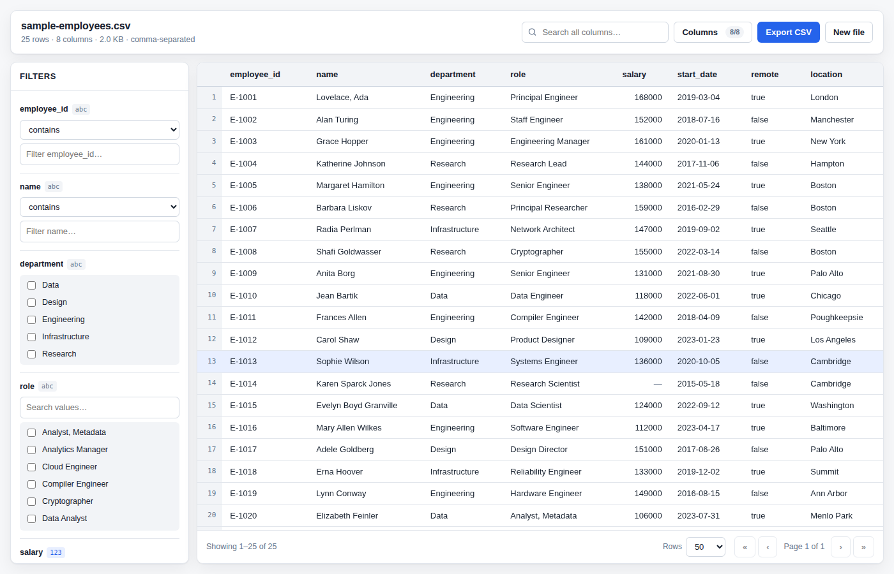
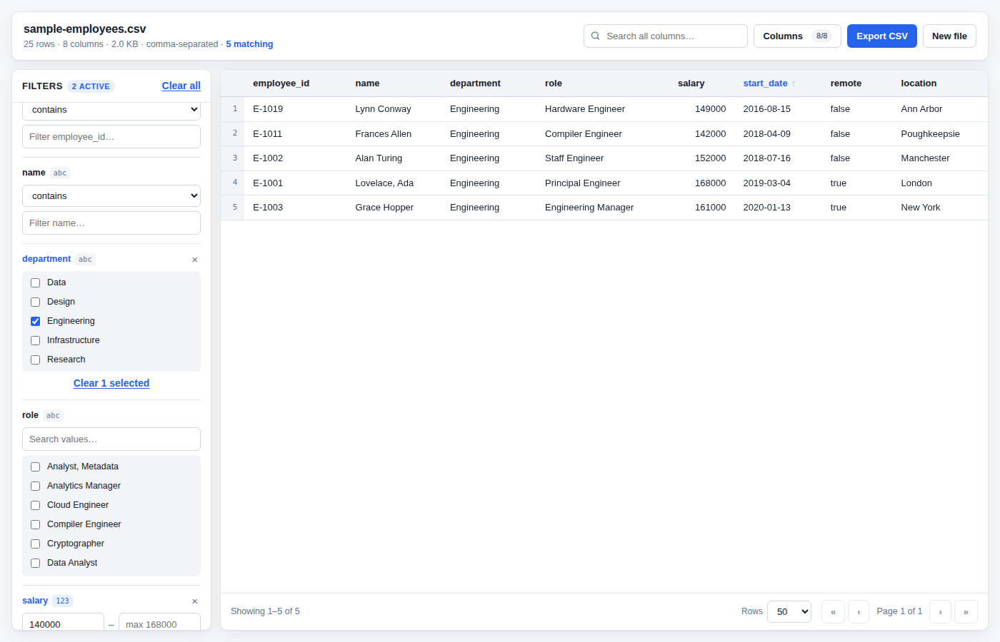

# CSV Explorer

A React page that takes a CSV file, renders it in the browser, and lets you filter it column by
column. Parsing, filtering, sorting and exporting all happen client-side — no server, no upload,
no third-party CSV library.



## Quick start

```bash
npm install
npm run dev        # http://localhost:5173
```

| Script | What it does |
| --- | --- |
| `npm run dev` | Vite dev server with hot reload |
| `npm run build` | Typecheck, then build to `dist/` |
| `npm run preview` | Serve the production build locally |
| `npm test` | Run the full test suite once |
| `npm run test:watch` | Run tests in watch mode |
| `npm run typecheck` | TypeScript, no emit |

No file handy? Click **Load the sample dataset** on the upload screen.

## What it does

**Upload** — drag and drop, click to browse, or press <kbd>Enter</kbd> on the focused dropzone.
Non-CSV files and files over 25 MB are rejected with a message that says why. The delimiter is
detected automatically: comma, semicolon, tab or pipe.

**Display** — a sortable table with a sticky header, a sticky row-number gutter, right-aligned
numeric columns, and paging at 25–500 rows a page. Empty cells render as `—` rather than as
nothing, so a blank is distinguishable from a narrow column.

**Filter, per column and by type.** Every column gets the control that suits its data:

| Inferred type | Control | Example |
| --- | --- | --- |
| Number | min / max range, with the column's real range as placeholder text | `salary` between 140000 and ∞ |
| Date | from / to date pickers, inclusive of both endpoints | `start_date` from 2023-01-01 |
| Boolean, or any column whose values repeat (≤ 25 distinct) | checkbox list, searchable once it passes 8 values | `department` is Design **or** Research |
| Free text | contains / does not contain / equals / starts with / is empty / is not empty | `name` starts with "A" |

Filters across different columns combine with AND, and a global search box matches any cell in a
row, highlighting the hits. Column filters, search and sort compose: narrow with checkboxes, then
search inside the result, then sort it.

**Beyond the brief** — column show/hide, export of exactly what is on screen (visible columns,
filtered rows, current sort) back to a valid CSV, and a light/dark theme that follows the OS.



## How it is built

```
src/
├── App.tsx                  State container: filters, search, sort, paging, visibility
├── types.ts                 Shared domain types (Column, Row, Filter, Dataset)
├── components/
│   ├── FileDropzone.tsx     Drag-drop + click + keyboard upload surface
│   ├── Toolbar.tsx          File summary, global search, columns menu, export
│   ├── FilterPanel.tsx      One filter per column
│   ├── ColumnFilter.tsx     The type-specific controls
│   ├── DataTable.tsx        Sortable sticky table, memoised cells, match highlighting
│   ├── Pagination.tsx       Page controls and the row-count summary
│   └── TypeBadge.tsx        The inferred-type chip
├── hooks/
│   ├── useCsvFile.ts        File reading, validation, loading/error states
│   └── useDebouncedValue.ts Keeps typing from re-scanning rows per keystroke
└── lib/                     Pure, framework-free, fully unit-tested
    ├── csv.ts               RFC 4180 parser, delimiter detection, serializer
    ├── values.ts            Number/date/boolean parsing, per-column type inference
    ├── dataset.ts           Raw text → typed columns + rows
    ├── filtering.ts         Filter, search and sort engine
    ├── stats.ts             Column min/max for range hints
    └── format.ts            Byte/count formatting, CSV download
```

The rule the layout follows: **`lib/` holds the logic and knows nothing about React; components
render and know nothing about parsing.** That is what makes the interesting parts — quoted-field
handling, type inference, range filtering — testable without mounting anything, and it is why the
same engine would drop into a different UI unchanged.

Full detail in [docs/ARCHITECTURE.md](docs/ARCHITECTURE.md); the reasoning behind the
non-obvious calls is in [docs/DECISIONS.md](docs/DECISIONS.md); a walkthrough for someone just
using the page is in [docs/USER-GUIDE.md](docs/USER-GUIDE.md).

## Testing

```bash
npm test
```

68 tests across 5 files — Vitest for the logic, Testing Library for the UI:

- **`lib/csv.test.ts`** — quoted delimiters, escaped quotes, embedded newlines, CRLF/CR/LF, BOM,
  empty and trailing fields, delimiter detection, and a parse → serialize → parse round-trip.
- **`lib/values.test.ts`** — currency/thousands/percent/parenthesised numbers, ISO and slash
  dates, rejection of impossible dates like `2024-02-31`, and the type-inference thresholds.
- **`lib/dataset.test.ts`** — duplicate and blank headers, ragged rows, empty files.
- **`lib/filtering.test.ts`** — every filter mode, AND across columns, typed sorting, blanks last.
- **`App.test.tsx`** — the page itself, driven the way a user drives it: load a file, tick a
  checkbox, type a range, sort a column, hide a column, clear everything.

Two bugs in this repo were caught by those tests rather than by clicking around: a descending sort
that floated blank cells to the top, and a 25-row file whose unique `name` column was offered as
25 checkboxes.

## Deliberate limits

Worth naming rather than hiding:

- **Rendering is paged, not virtualised.** A 200k-row file parses and filters fine (rows are
  string tuples, filters short-circuit), but only one page is ever in the DOM. Virtualising the
  table is the next change if the requirement grows.
- **Parsing runs on the main thread.** Fine at the 25 MB cap; a Web Worker is the fix beyond it,
  and `lib/csv.ts` is already framework-free so it would move as-is.
- **Filters are AND-only.** No OR across different columns, no saved filter sets, no URL state.
- **Ambiguous slash dates assume M/D/Y**, falling back to D/M/Y when the first part exceeds 12.
