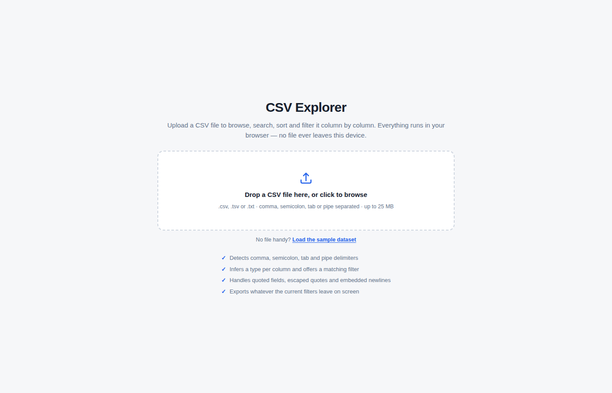
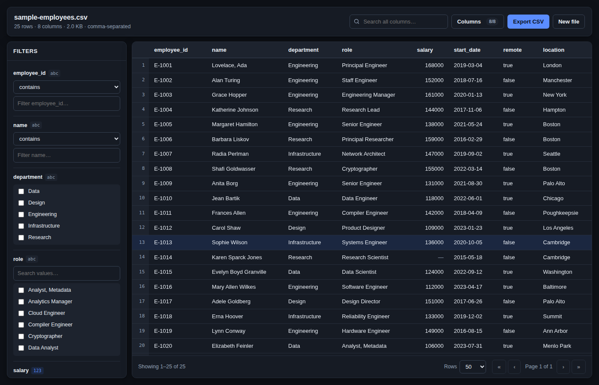

# User guide

## 1. Load a file



Drag a file onto the dashed area, click it to browse, or focus it and press <kbd>Enter</kbd>.
Accepts `.csv`, `.tsv` and `.txt` up to 25 MB, separated by commas, semicolons, tabs or pipes — the
separator is detected for you. To try the app without a file, click **Load the sample dataset**.

Everything happens in your browser. The file is never uploaded anywhere.

## 2. Read the header bar

```
sample-employees.csv
25 rows · 8 columns · 2.0 KB · comma-separated · 5 matching
```

`5 matching` appears once a filter is active, and always shows how many of the original rows are
still in view.

## 3. Filter a column

The left panel lists every column with a control chosen for its data. The small badge shows the
detected type: `123` numeric, `date`, `y/n` boolean, `abc` text.

| Badge | What you get | How it behaves |
| --- | --- | --- |
| `123` | Two boxes, **min** and **max** | Inclusive; leave either blank for an open end. Placeholders show the column's real range. |
| `date` | **From** and **to** date pickers | Inclusive of both days. |
| `abc` / `y/n` with repeating values | A checkbox list | Ticking several values matches **any** of them. A search box appears past 8 values. |
| `abc` free text | A mode dropdown and a text box | contains · does not contain · equals · starts with · is empty · is not empty. The last two need no text. |

Filters on **different** columns combine with AND — tick `Engineering` and set salary min `140000`
and you get engineers earning at least 140k. An active column turns blue; **×** clears that one,
**Clear all** at the top clears every filter and the search box.


## 4. Search everything at once

The search box in the top bar matches any cell in a row and highlights the matched text. It applies
*on top of* the column filters, so it is a way to search inside a result you have already narrowed.

## 5. Sort

Click any column header. The first click sorts ascending, the second descending, the third returns
the file's original order. Sorting is type-aware — numbers sort by value, dates chronologically —
and blank cells always sit at the bottom, whichever direction you pick.

## 6. Hide columns

**Columns** in the top bar opens a checkbox for every column; the counter reads `6/8` when two are
hidden. Hidden columns are also excluded from the export. Press <kbd>Esc</kbd> or click away to
close.

## 7. Export what you see

**Export CSV** downloads the current view — visible columns, filtered rows, current sort order — as
`<original-name>-filtered.csv`. Quotes, commas and newlines inside cells are re-escaped properly,
so the file re-opens cleanly here or in Excel.

## 8. Start over

**New file** returns to the upload screen and clears all state.

---

### Good to know

- **Empty cells** show as `—`. Filter for them with *is empty* on a text column.
- **A ragged row** — more or fewer cells than the header — is padded or trimmed to fit, and a
  banner tells you how many rows that affected. Nothing is dropped.
- **A wrong type guess?** Text columns keep every match mode, so you can always fall back to
  `contains`.
- **Dark mode** follows your operating system setting.


